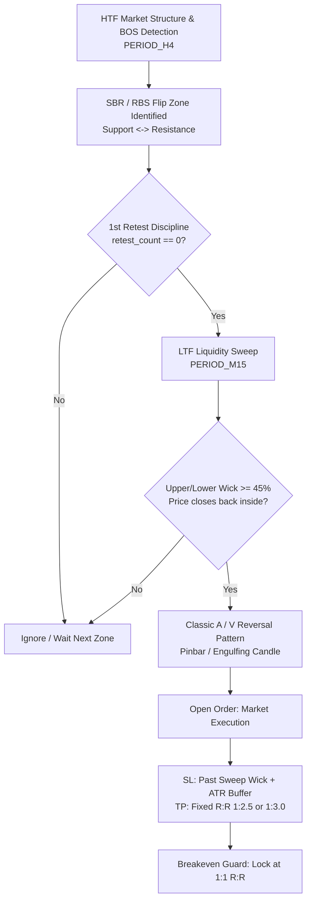

# MetaTrader 5 Expert Advisors Collection

[](https://www.mql5.com)
[](https://www.metatrader5.com)
[](LICENSE)

A collection of algorithmic trading Expert Advisors (EAs), Scripts, and parameter presets for MetaTrader 5 (MT5).

---

## Repository Structure

```text
.
├── Experts/                      # MQL5 Expert Advisor source files (.mq5)
│   ├── HaruuSignalReceiver.mq5
│   ├── Zerith_Crypto_Ichimoku_H4_EA.mq5
│   ├── Zerith_Gold_Adaptive_MeanReversion_EA.mq5
│   ├── Zerith_Gold_Advanced_Grid_EA.mq5
│   ├── Zerith_Gold_MultiZone_Breakout_EA.mq5
│   ├── Zerith_Gold_Trade_Pro_EA.mq5
│   ├── Zerith_London_Breakout_Recovery_EA.mq5
│   ├── Zerith_MACD_Martingale_Grid_EA.mq5
│   ├── Zerith_ML_CandleData_Exporter_EA.mq5
│   ├── Zerith_News_Straddle_ReverseTrailing_EA.mq5
│   ├── Zerith_Oneshot.mq5
│   ├── Zerith_SBR_Liquidity_Sweep_EA.mq5
│   ├── Zerith_Supertrend_MultiStrategy_EA.mq5
│   ├── Zerith_XAU_Scalping_EA.mq5
│   └── Zerith_XAU_SwingGrid_Recovery_EA.mq5
├── Indicators/                   # Custom Indicators (Pine Script / MQL5)
│   ├── Zerith_Supertrend_DeMarker_Signal.pine
│   └── Zerith_Supertrend_StochRSI_Signal.pine
├── Scripts/                      # MQL5 Script source files (.mq5)
│   └── ExportMultiData_M5.mq5
├── presets/                      # Parameter preset files (.set)
│   ├── Advanced_Grid/
│   │   ├── Conservative_XAUUSD.set
│   │   ├── Balanced_XAUUSD.set
│   │   └── Aggressive_XAUUSD.set
│   ├── MeanReversion_Grid/
│   │   ├── SmallAccount_500USD.set
│   │   ├── Standard_2000USD.set
│   │   └── Pro_5000USD.set
│   ├── News_Straddle/
│   │   ├── XAUUSD_Gold_News_Straddle.set
│   │   └── Forex_Major_News_Straddle.set
│   └── SBR_Liquidity_Sweep/
│       ├── XAUUSD_H4_M15_Gold.set
│       └── EURUSD_H4_M15_Forex.set
├── LICENSE                       # MIT License
└── README.md                     # Repository documentation
```

---

## Available Files

### Expert Advisors (Zerith Series)
| File | Strategy / Target Asset | Description |
| :--- | :--- | :--- |
| [`Experts/Zerith_ML_CandleData_Exporter_EA.mq5`](Experts/Zerith_ML_CandleData_Exporter_EA.mq5) | Machine Learning Data Pipeline / Multi-Asset | Raw Candlestick (OHLCV + Spread + Real Volume) Historical & Strategy Tester Backtest Exporter to CSV with Dynamic Date-Range Naming (`<Symbol>_<TF>_<Start>_to_<End>.csv`) |
| [`Experts/Zerith_Gold_MultiZone_Breakout_EA.mq5`](Experts/Zerith_Gold_MultiZone_Breakout_EA.mq5) | Multi-Zone Structural Swing Breakout / XAUUSD | 6 Autonomous H1 Market Structure Breakout Modules with Dynamic Daily Price Scaling, Multi-Tier BE/Trailing & Prop DD Guard |
| [`Experts/Zerith_SBR_Liquidity_Sweep_EA.mq5`](Experts/Zerith_SBR_Liquidity_Sweep_EA.mq5) | Smart Money Concepts (SMC) / Gold & FX | Multi-Timeframe SBR/RBS Flip Zones with LTF Liquidity Sweep & Classic A/V Reversal Trigger |
| [`Experts/Zerith_News_Straddle_ReverseTrailing_EA.mq5`](Experts/Zerith_News_Straddle_ReverseTrailing_EA.mq5) | High-Impact News Straddle / Gold & FX | News Straddle Breakout EA with Opposite Stop Order Trailing SL, Automated Reversal Flip, and Capital Protection |
| [`Experts/Zerith_Gold_Trade_Pro_EA.mq5`](Experts/Zerith_Gold_Trade_Pro_EA.mq5) | Daily Support/Resistance Breakout / XAUUSD | 7 Daily Breakout Modules with Multi-Stage Trailing Stop & Drawdown Protection |
| [`Experts/Zerith_Supertrend_MultiStrategy_EA.mq5`](Experts/Zerith_Supertrend_MultiStrategy_EA.mq5) | Supertrend + 12 MTF DeMarker Matrix / XAUUSD & FX | Multi-Strategy Portfolio Engine with Smart Recovery Grid & Dynamic ATR Spacing |
| [`Experts/Zerith_Oneshot.mq5`](Experts/Zerith_Oneshot.mq5) | 12 MTF DeMarker Matrix / One-Shot + Recovery Grid | First-Instinct One-Shot Initial Entry with Dual-Mode Recovery Grid (100% Original Fixed vs Expanding Multiplier) & Original BE/Trailing Engine |
| [`Experts/Zerith_London_Breakout_Recovery_EA.mq5`](Experts/Zerith_London_Breakout_Recovery_EA.mq5) | London Session Range Breakout (ORB) / GBPUSD & FX | Asian/London Box Breakout with OCO Cancellation & Smart Recovery System |
| [`Experts/Zerith_Gold_Advanced_Grid_EA.mq5`](Experts/Zerith_Gold_Advanced_Grid_EA.mq5) | Advanced Dynamic Grid / XAUUSD | Multi-Tier Dynamic Grid with ATR Volatility Adaptation |
| [`Experts/Zerith_Gold_Adaptive_MeanReversion_EA.mq5`](Experts/Zerith_Gold_Adaptive_MeanReversion_EA.mq5) | Mean Reversion Grid / XAUUSD | Adaptive Statistical Mean Reversion on Gold |
| [`Experts/Zerith_MACD_Martingale_Grid_EA.mq5`](Experts/Zerith_MACD_Martingale_Grid_EA.mq5) | Trend Momentum Grid / Multi-Asset | MACD Zero-Cross Trend Following Grid |
| [`Experts/Zerith_Crypto_Ichimoku_H4_EA.mq5`](Experts/Zerith_Crypto_Ichimoku_H4_EA.mq5) | Trend Following / Crypto | H4 Multi-Timeframe Ichimoku Kinko Hyo Cloud Breakout |
| [`Experts/Zerith_XAU_Scalping_EA.mq5`](Experts/Zerith_XAU_Scalping_EA.mq5) | One-Shot Breakout Engine / XAUUSD | Pure M1 Momentum Breakout Scalper with Dynamic ATR Take-Profit, Ticket/Hard USD Stop-Loss & Real-Time Trailing Stop (Zero Grid/Martingale) |
| [`Experts/Zerith_XAU_SwingGrid_Recovery_EA.mq5`](Experts/Zerith_XAU_SwingGrid_Recovery_EA.mq5) | Daily Swing & ATR Grid Recovery / XAUUSD | Breakout Entry with Dynamic Yesterday-Swing/10 + Multi-TF ATR Grid Spacing, Anti-Martingale Deep Lots & Basket Trailing |
| [`Experts/HaruuSignalReceiver.mq5`](Experts/HaruuSignalReceiver.mq5) | Signal Receiver / Multi-Asset | Webhook / Telegram Signal Execution Engine |

### Indicators (TradingView / Pine Script)
| File | Platform | Description |
| :--- | :--- | :--- |
| [`Indicators/Zerith_Supertrend_DeMarker_Signal.pine`](Indicators/Zerith_Supertrend_DeMarker_Signal.pine) | TradingView (Pine Script v6) | 12-Strategy MTF DeMarker Engine with Supertrend Trend Filter & Live Dashboard |
| [`Indicators/Zerith_Supertrend_StochRSI_Signal.pine`](Indicators/Zerith_Supertrend_StochRSI_Signal.pine) | TradingView (Pine Script v6) | Supertrend Trend Following + DeMarker & Stoch RSI Entry with Cooldown & Anti-Sideway Filters |

### Scripts
| File | Description |
| :--- | :--- |
| [`Scripts/ExportMultiData_M5.mq5`](Scripts/ExportMultiData_M5.mq5) | Multi-Currency M5 Historical Data Exporter |

---

## ⚡ Zerith News Straddle Reverse-Trailing EA (Opposite Stop Order Trailing SL)

Designed specifically for high-volatility news events (US Non-Farm Payrolls, CPI Inflation, FOMC Rate Decisions, PPI, GDP).

### Core Strategy Mechanics:
1. **News Straddle Entry**:
   - Places a **Buy Stop** above Ask and a **Sell Stop** below Bid at a configurable distance (`InpStraddleDistancePoints`).
   - Triggered either manually via on-chart button (`[🚀 PLACE NOW]`), immediately upon launch, or scheduled before news time countdown.
2. **Opposite Stop Order Trailing SL**:
   - When a breakout occurs and **Buy Stop** triggers at e.g. 4000:
     - The pending **Sell Stop** (at 3998) is retained on the book and acts as both the **Stop Loss** and the **Reversal Entry**.
     - As price advances into profit (e.g. price reaches 4001), the Sell Stop is dynamically trailed up to 4000 (locking in breakeven/profit).
     - As price continues advancing (4002, 4003...), the Sell Stop continually trails upward behind the market.
3. **Automated Reversal & Direction Flip**:
   - If market whip-saws and hits the trailed Sell Stop:
     - The Sell Stop executes into an active **SELL position**.
     - The EA immediately **closes the previous BUY position**.
     - A brand-new **BUY STOP** is placed above the current price at the specified distance.
     - The new Buy Stop now becomes the dynamic trailing SL and reversal trigger for the Sell trade.
   - Supports configurable lot multipliers (`InpReverseMultiplier`) and maximum reversal cycles (`InpMaxReversals`).
4. **Safety & Capital Protection**:
   - Spread filter prevents order placement if broker spread widens excessively right before news releases.
   - Max Daily Loss % and Floating Drawdown % equity guards.
   - On-chart interactive HUD dashboard with one-click **[PLACE NOW]**, **[CANCEL PENDING]**, and **[CLOSE ALL & RESET]** buttons.

---

## 🎯 Zerith SBR/RBS + Classic A/V + Liquidity Sweep EA (Smart Money Concepts)

Designed to automate the institutional Smart Money Concepts (SMC) reversal methodology using a 3-layer confluence model.



### Core Strategy Mechanics:
1. **Multi-Timeframe Structure & Flip Zones (HTF - H4/D1)**:
   - Scans HTF pivot points using swing left/right validation.
   - Detects Break of Structure (BOS):
     - **Bearish BOS:** HTF bar closes below previous Swing Low $\rightarrow$ Flips into **SBR (Support Becomes Resistance)**.
     - **Bullish BOS:** HTF bar closes above previous Swing High $\rightarrow$ Flips into **RBS (Resistance Becomes Support)**.
   - Dynamic Zone Buffer calculated automatically via `ATR(HTF) * InpZoneAtrMult`.
2. **Strict 1st Retest Discipline**:
   - Only trades the **very first retest** of the freshly formed flip zone (`InpOnlyFirstRetest = true`).
   - Prevents chasing degraded zones where institutional liquidity has already been exhausted.
3. **LTF Liquidity Sweep / Stop Hunt Trigger (LTF - M15/M5)**:
   - Verifies price sweeps beyond the SBR/RBS level to purge retail stop orders.
   - **Wick Ratio Rule:** Candlestick wick must constitute $\ge 45\%$ of total candle range.
   - **Rejection Close:** Candle must close back inside/below SBR (for Sell) or inside/above RBS (for Buy).
4. **Classic A / Classic V Reversal Patterns**:
   - **Classic A (Top Reversal):** Fast run-up into resistance, culminating in a sharp A-peak rejection (Shooting star pinbar or Bearish Engulfing).
   - **Classic V (Bottom Reversal):** Fast sell-off into support, culminating in a sharp V-trough rebound (Hammer pinbar or Bullish Engulfing).
5. **Trade Execution & Capital Protection**:
   - **Stop Loss:** Anchored directly behind the liquidity sweep wick plus ATR buffer.
   - **Take Profit:** Configured with positive mathematical expectancy ($1:2.5$ or $1:3.0$ R:R).
   - **Breakeven Engine:** Automatically locks Stop Loss to entry $+ \text{buffer}$ once the position hits $1:1$ R:R.
   - **Prop-Firm Guards:** Max Daily Loss % and Max Floating Drawdown % equity limits.

---

## 🪙 Zerith XAU Scalping EA (Pure One-Shot Breakout Engine with Decision Matrix - v18.00)

A streamlined, high-speed algorithmic breakout scalper engineered specifically for **XAUUSD (Gold)** on MetaTrader 5. Built for disciplined **One-Shot** execution (zero Martingale, zero DCA Grid) while retaining the full multi-timeframe Decision Matrix, Choppy Trend Filter, HTF Trend Confluence, and AI Performance Confirmation.

```mermaid
flowchart TD
    A[Multi-TF Market Ingestion\nM1, M5, M15, H1, H4 Cached Bars] --> B[Market Regime Engine\nVOLATILE | CHOPPY | TREND_STRONG | RANGE | NORMAL]
    B --> C{Choppy Filter\nM15 vs H1 Trend Conflict?}
    C -- Yes --> Z[HALT / Stay Out]
    C -- No --> D{Breakout Setup\nVolatile Spike or Strong Trend Momentum?}
    D -- No --> Z
    D -- Yes --> E{HTF & Macro Guards\nH1/H4 Trend Confluence?}
    E -- No --> Z
    E -- Yes --> F{AI Performance Gate\nBreakout Score Conf >= 60%?}
    F -- No --> Z
    F -- Yes --> G[Execute One-Shot Market Order\nStrictly 1 Active Trade]
    G --> H[Dynamic ATR TP\nInpTpPointsBase + ATR Multiplier]
    G --> I[Dual Stop-Loss\nTicket SL Points + Hard USD Emergency SL]
    G --> J[Real-Time Trailing Stop\nActivation Trigger + Trailing Callback Step]
```

### Core Strategy Mechanics:
1. **Multi-Timeframe Market Regime Engine**:
   - Analyzes real-time structure across 5 timeframes (M1, M5, M15, H1, H4) using ultra-fast bar caching.
   - Evaluates volatility (M1 ATR vs M5 ATR ratio, `InpVolatilityAtrPts`), directional trend alignment, and ADX momentum.
2. **Choppy Market Filter (Trend Conflict Protection)**:
   - Evaluates M15 vs H1 directional trends: if M15 is UP while H1 is DOWN (or vice versa), market regime is flagged as **CHOPPY**.
   - Trading is immediately halted during choppy conditions to protect against whipsaws and false breakout traps.
3. **Pure Momentum Breakout Execution**:
   - **Volatile Regime:** Enters when M1 Fast EMA (20) confirms trend over Slow EMA (50) and MACD Histogram accelerates in trade direction.
   - **Strong Trend Regime:** Enters trend-aligned breakouts when H1 ADX > `InpTrendAdx` and M1 aligns with the established macro trend.
   - **Other Strategy Logics Removed:** Mean Reversion and Pullback logic are cleanly excised; only high-conviction Breakout is executed.
4. **HTF Trend & Macro Confirmation**:
   - Optional strict H1 trend filter (`InpUseHtfFilter`).
   - Macro H4 guard prevents counter-trend breakout entries during strong opposing HTF movements.
5. **AI Performance Confidence Gating**:
   - Tracks rolling 30-trade win rate specifically for Breakout (`g_scoreBreakout`).
   - Dynamically scales trade confidence; automatically gates (pauses) new entries if strategy confidence drops below 60%.
6. **Strict One-Shot Discipline (No Grid / No Martingale)**:
   - 100% stripped of multi-layer recovery, Martingale multipliers, DCA grids, and averaging.
   - Strictly holds **one active position at a time**.
7. **Dynamic Take-Profit, Dual Stop-Loss & Trailing Stop**:
   - **Dynamic ATR TP:** Target adapts to market volatility ($\text{TP} = \text{Base} + \text{ATR} \times \text{Multiplier}$).
   - **Dual SL Architecture:** Broker-side ticket SL (`InpStopLossPoints = 300`) + emergency hard USD stop (`InpStopLossUsd = $5.0`).
   - **Real-Time Trailing Stop:** Tracks high-water mark profit; triggers trailing protection once target profit is reached (`InpTrailingTriggerUsd = $2.0`) and steps up (`InpTrailingStepUsd = $1.0`).
8. **Comprehensive HUD Dashboard (v18.00)**:
   - Full 2-column display: Live Account metrics, Decision Matrix & Regime, S/R levels, Active Position details, Breakout AI Score bar, Multi-TF Confluence matrix (M1-H4), Statistics, and Risk Limit status.


---

## 🌪️ Zerith XAU SwingGrid Recovery EA (Dynamic Daily Swing + Multi-TF ATR Spacing)

A state-of-the-art algorithmic recovery engine engineered specifically for **XAUUSD (Gold)** on MetaTrader 5. It replaces rigid static grid distances with a daily market-adaptive spacing formula: **(Yesterday's Daily Swing / 10) + Configurable Multi-TF ATR**, combined with an Anti-Martingale deep lot recovery model, unified basket trailing stops, and staged partial closes.

```mermaid
flowchart TD
    A[Daily Ingestion\nYesterday D1 High - Low Swing] --> B[Dynamic Grid Formula\nGap = YesterdaySwing/10 + ATR(TF) * Mult]
    C[Multi-Strategy Engine\nTrend, MeanRev, Breakout, Pullback] --> D{Initial Entry Trigger\nConfidence >= 60% & Spread OK?}
    D -- No --> Z[Wait Next Bar]
    D -- Yes --> E[Execute Initial Position\nLayer 1: Base Lot]
    E --> F{Market Advances to TP?}
    F -- Yes --> G[Unified Basket ATR TP / Basket Trailing]
    F -- No --> H{Price Adverse Move >= Dynamic Grid Gap?}
    H -- Yes --> I[Momentum & HTF Trend Filter Check\nWait for Rejection Confirmation]
    I --> J[Open Recovery Layer n+1\nAdaptive Lot: Early 1.3x -> Mid 1.5x -> Deep >=6: 0.8x]
    J --> K[Update Unified Basket TP & Trailing Stop]
    K --> L{Staged Partial Close or Breakeven Exit?}
    L -- Yes --> M[De-risk Floating Exposure / Escape at Breakeven]
```

### Core Strategy Mechanics:
1. **100% Faithful to Optimized v17 Base Architecture**:
   - Retains all 4 strategies (Trend, Mean Reversion, Breakout, Pullback), Decision Matrix, AI Scores, and interactive 2-column HUD Dashboard intact from optimized v17.
2. **Dynamic Daily Swing + Multi-TF ATR Grid Spacing**:
   - **Yesterday's Swing Part:** Measures the complete high-to-low range of yesterday's D1 candle ($\text{High}_{\text{D1}} - \text{Low}_{\text{D1}}$) and divides by a configurable divisor (`InpSwingDivisor = 10.0`).
   - **Configurable ATR Part:** Adds real-time volatility from a user-specified timeframe and period (`InpGridAtrTf = PERIOD_H1`, `InpGridAtrPeriod = 14`, `InpGridAtrMult = 1.0`).
   - **Full Gap Protection:** Strict distance requirement $(\text{Yesterday Swing} / 10) + \text{ATR}$; does not prematurely shrink the grid spacing.
   - **Progressive Layer Expansion:** Expands spacing at deeper layers (`+10% per layer`) to provide exponentially wider breathing room against strong sustained trends.
3. **Anti-Martingale Deep Layer Lot Sizing**:
   - Avoids toxic exponential martingales: early layers step up moderately ($1.3\times \rightarrow 1.5\times$), while deep layers ($\ge 6$) **drop below 1.0x ($0.8\times$)** to prevent margin exhaustion during extended moves.
4. **Comprehensive Capital & Risk Protections**:
   - **Unified Basket ATR TP (ปิดรวบ):** Dynamic profit target adapting to current volatility; closes all active basket layers simultaneously when target is reached.
   - **Basket USD Trailing Stop:** Protects floating basket profits in real time ($5 trigger / $2 trail).
   - **Staged Partial Close:** Takes partial profits ($30\%$) off winning layers when in recovery.
   - **Breakeven Escape:** Automatically exits at breakeven ($\ge \$0.00$) once deep adverse excursions recover.
   - **Hard USD Basket Stop-Loss & Max Holding Hours:** Maximum loss cap and time-based basket liquidation.
5. **Interactive 2-Column HUD Dashboard**:
   - Displays live metrics for Account Equity/DD, Decision Matrix, AI Scores, Multi-TF Confluence (M1-H4), Win Rate, Profit Factor, Active Basket layers, Average-to-TP prices, Next recovery lot, and Prop-Firm risk limits.

---

## ⚡ Zerith Gold Multi-Zone Breakout EA (H1 Structural Swing Breakout)

Designed specifically for **XAUUSD (Gold)** on the **H1 Timeframe**, featuring 6 autonomous breakout engines operating across distinct trading windows with dynamic volatility-scaled profit targets.

### Core Architecture & Mechanics:
1. **Multi-Zone Swing Pivot Detection (Non-Repainting)**:
   - Identifies key structural Swing Highs and Swing Lows on H1 bars using left/right pivot confirmation windows.
   - Places pending **Buy Stop** orders above swing highs and **Sell Stop** orders below swing lows.
   - Zero market chasing: entries only trigger on explosive structural breaks.
2. **6 Autonomous Breakout Zones**:
   - **Zone A1 (Magic `Base + 9`)**: H1 Base Breakout (26R / 24L pivots, 120 pts buffer, 824 pts base TP). Active in London, Overlap, and New York.
   - **Zone A2 (Magic `Base + 14`)**: H1 Base Breakout (25R / 23L pivots, 10 pts buffer, 1522.5 pts base TP). Active in London and Overlap.
   - **Zone A3 (Magic `Base + 15`)**: H1 Base Breakout (26R / 20L pivots, 80 pts buffer, 1284 pts base TP). Multi-session coverage.
   - **Zone B1 (Magic `Base + 13`)**: H1 Mid Breakout (7R / 5L pivots, 40 pts buffer, 1485 pts base TP). Active across all sessions except Wednesdays.
   - **Zone B2 (Magic `Base + 12`)**: H1 Mid Breakout (30R / 19L pivots, 160 pts buffer, 927 pts base TP). Broad active window.
   - **Zone B3 (Magic `Base + 8`)**: H1 Macro Swing Breakout (7R / 2L pivots, 250 pts buffer, 3630 pts base TP). Macro expansion target.
3. **Dynamic Daily Price Scaling (Auto-Volatility Adaptation)**:
   - TP distance dynamically adapts to prevailing gold prices relative to historical baseline open prices (`prev_daily_open / scale_base`).
   - Higher price regimes automatically expand target distances to maintain mathematical risk-reward consistency.
4. **Multi-Tier Trailing Stop & Breakeven Lock**:
   - **Tier 1 (BE Profit Lock):** Locks in +10 points as soon as profit reaches the dynamic trigger threshold ($110 \times \text{scale}$).
   - **Tier 2 (Lock Distance):** Ensures minimum protected gain of $30 \times \text{scale}$ points.
   - **Tier 3 (Dynamic Trail):** Continually trails behind spot prices at $121 \times \text{scale}$ points.
5. **Prop Firm & Capital Protection Guard**:
   - Hard Stop Loss (default 3000 points / $30 on Gold).
   - Real-time Daily Drawdown Monitor: closes all active positions and cancels pending orders if daily drawdown exceeds `InpMaxDailyDDPercent` (default 4.0%).
   - Integrated offline US Non-Farm Payrolls (NFP) calendar filter.

---

## Installation and Setup (MT5)

1. Clone or Download Repository:
   ```bash
   git clone https://github.com/BlamzKunG/My-Expert-Advisor.git
   ```
2. Copy Files to MT5 Data Folder:
   - In MetaTrader 5, click File -> Open Data Folder.
   - Copy all files from `Experts/` into `MQL5/Experts/`.
   - Copy all files from `Scripts/` into `MQL5/Scripts/`.
   - Copy the `presets/` folder into `MQL5/Presets/`.
3. Compile:
   - Open MetaEditor (F4).
   - Open the target EA or Script from the Navigator panel.
   - Click Compile (F7) and ensure 0 errors, 0 warnings.
4. Attach to Chart:
   - Drag the compiled EA from MT5 Navigator onto your chart.
   - In the EA settings popup, check "Allow Algo Trading".
   - (Optional) Click Load in the Inputs tab to select a `.set` file from `presets/`.

---

## Adding New Files to this Collection

1. Place new Expert Advisors in `Experts/`.
2. Place new Scripts in `Scripts/`.
3. Place associated presets in `presets/<EA_Name>/`.
4. Update the Available Files table in this README.

---

## License and Disclaimer

- License: Distributed under the MIT License.
- Risk Disclaimer: Trading foreign exchange, commodities, and CFDs carries a high level of risk. These Expert Advisors are provided for educational and research purposes. Use at your own discretion.
